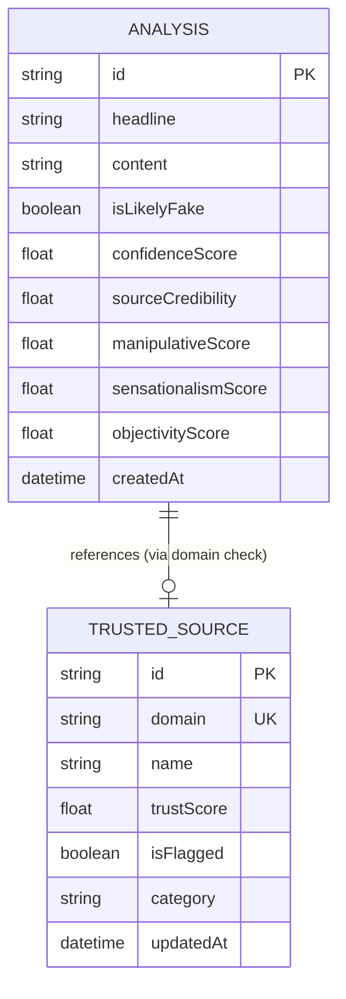

# Entity Relationship Diagram

This diagram illustrates the data structure used by VeriNews AI to store analyses and track source credibility.

## Tables Description

### Analysis
Stores the results of every news check performed by the system.
- **isLikelyFake**: Boolean verdict from the AI.
- **confidenceScore**: 0-100 score indicating how sure the AI is.
- **scores**: Various linguistic metrics (sensationalism, manipulative, objectivity).

### Trusted Source
A curated database of news domains used to weigh the credibility of incoming articles.
- **trustScore**: Baseline reputation of the domain (0-100).
- **isFlagged**: Whether the source is known for spreading misinformation.
- **category**: Classification (e.g., Mainstream, Satire, Propaganda).
