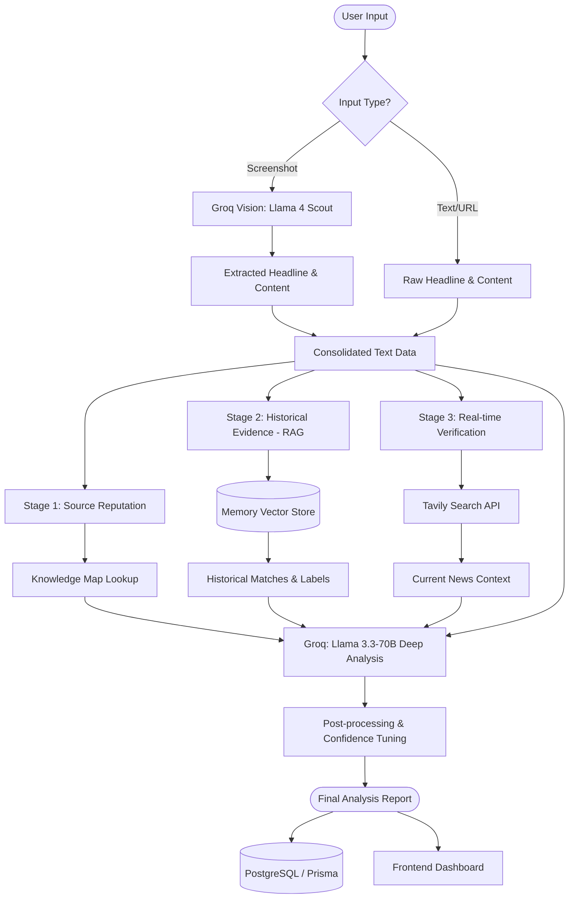

# Analysis Pipeline Diagram

The following diagram details the multi-stage processing pipeline for fake news detection, involving Vision AI, RAG, and Real-time Web Search.

## Pipeline Stages

1.  **Ingestion & Vision**: If a screenshot is provided, the system uses OCR/Vision models to extract text.
2.  **Source Reputation**: The system checks the source domain against a database of known entities to determine a baseline trust score.
3.  **RAG (Retrieval Augmented Generation)**: A vector database of known fake and real news is queried to find semantically similar historical cases.
4.  **Real-time Web Search**: The system performs a live search to see if the claim is being reported by other reputable sources or debunked by fact-checkers.
5.  **Multi-Signal LLM Analysis**: An LLM synthesizes the source reputation, RAG evidence, and search results to provide a final verdict with detailed linguistic scoring.
6.  **Persistence**: The results are logged for future reference and analytics.
