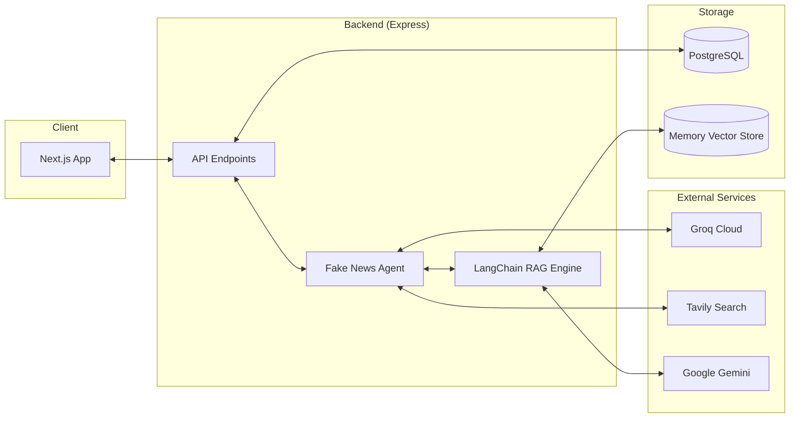

# System Architecture

VeriNews AI is a modern, full-stack application designed to detect misinformation using a combination of LLMs, RAG, and real-time data.

## Tech Stack

### Frontend
- **Framework**: Next.js 15 (React)
- **Styling**: Tailwind CSS
- **Visualization**: Recharts (for analysis scores)
- **State Management**: React Hooks & Context API

### Backend
- **Runtime**: Node.js with TypeScript
- **API Framework**: Express
- **ORM**: Prisma
- **Database**: PostgreSQL
- **AI Orchestration**: LangChain

### AI Models & Services
- **Primary LLM**: Groq (Llama 3.3-70B) for deep analysis.
- **Vision Model**: Groq (Llama 4 Scout) for text extraction from images.
- **Embeddings**: Google Gemini (gemini-embedding-001) for vector search.
- **Search API**: Tavily for real-time web verification.

## Component Architecture

## Key Features
- **Deep Intelligence Analysis**: Goes beyond simple keyword matching to analyze linguistic intent and objectivity.
- **Visual Evidence Extraction**: Supports screenshots for ease of use in social media contexts.
- **Source Fingerprinting**: Identifies and scores the credibility of news domains.
- **Conversational Follow-up**: Context-aware chat to ask questions about specific analysis results.
